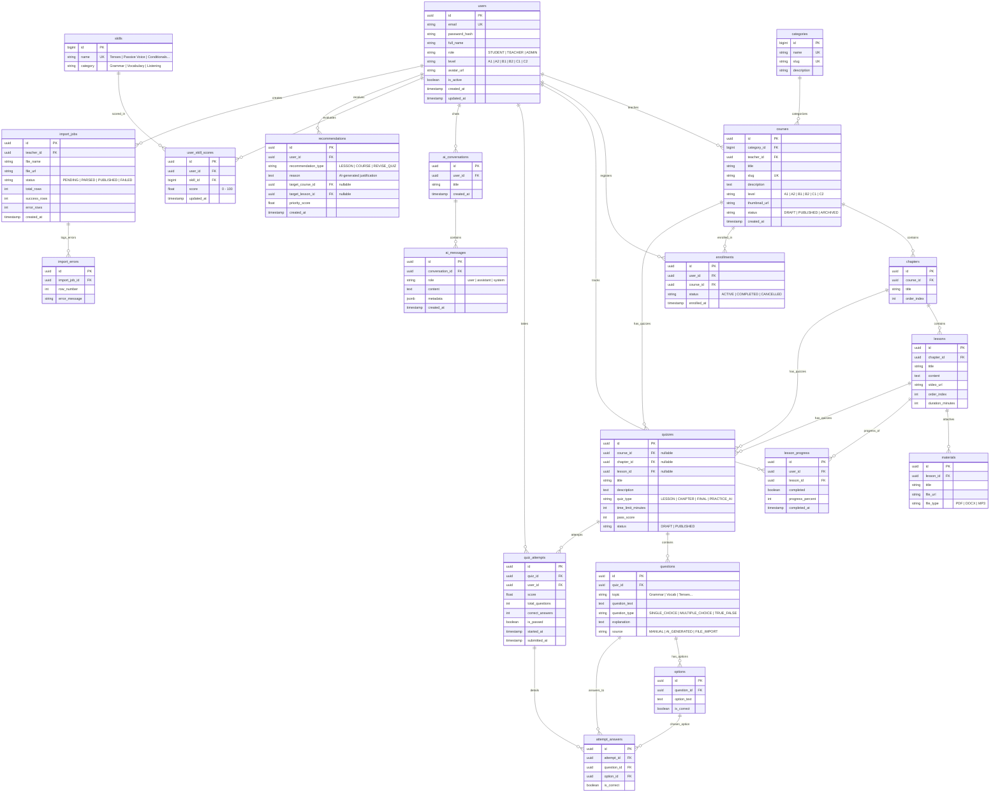

# THIẾT KẾ CƠ SỞ DỮ LIỆU & SƠ ĐỒ THỰC THỂ QUAN HỆ (ERD)

> **Hệ quản trị CSDL:** PostgreSQL  
> **Tổng số bảng thực thể:** 18 bảng (chia theo 7 modules của Modular Monolith)

---

## 1. Sơ đồ thực thể quan hệ (Mermaid ERD)

---

## 2. Chi tiết 18 bảng theo từng module chức năng

### Nhóm 1: `apps.accounts` (Người dùng & Phân quyền)
1. **`users`**: Bảng người dùng tùy chỉnh kế thừa `AbstractBaseUser`. Lưu email (khóa chính đăng nhập), họ tên, vai trò (`STUDENT`, `TEACHER`, `ADMIN`), trình độ ngoại ngữ (`A1`-`C2`), ảnh đại diện.

### Nhóm 2: `apps.courses` (Khóa học, Chương, Bài học & Tài liệu)
2. **`categories`**: Danh mục khóa học (Tiếng Anh giao tiếp, IELTS, TOEIC, Ngữ pháp cơ bản...).
3. **`courses`**: Khóa học do giáo viên quản lý, có cấp độ, trạng thái (`DRAFT`, `PUBLISHED`, `ARCHIVED`).
4. **`chapters`**: Chương học trong khóa, có thứ tự sắp xếp `order_index`.
5. **`lessons`**: Bài học chi tiết, lưu nội dung bài viết, link video bài giảng, thời lượng học.
6. **`materials`**: Tài liệu đính kèm bài học (File PDF, Slide, Audio nghe).

### Nhóm 3: `apps.learning` (Ghi danh & Tiến độ học tập)
7. **`enrollments`**: Lưu thông tin học viên đăng ký tham gia khóa học.
8. **`lesson_progress`**: Tiến độ hoàn thành từng bài học (% hoàn thành, trạng thái `completed`, thời điểm hoàn thành).

### Nhóm 4: `apps.assessments` (Bài kiểm tra & Chấm điểm)
9. **`quizzes`**: Đề kiểm tra gắn liền với Khóa học (`course_id`), Chương học (`chapter_id`), Bài học (`lesson_id`) hoặc Đề ôn tập nhanh do AI sinh theo tiến độ bài học (`quiz_type`: `LESSON`, `CHAPTER`, `FINAL`, `PRACTICE_AI`), thời gian làm bài, điểm qua môn.
10. **`questions`**: Câu hỏi trắc nghiệm, lưu topic, loại câu hỏi, nguồn tạo (`MANUAL`, `AI_GENERATED`, `FILE_IMPORT`) và phần giải thích đáp án (`explanation`).
11. **`options`**: Các lựa chọn A, B, C, D cho câu hỏi kèm cờ `is_correct`.
12. **`quiz_attempts`**: Lịch sử mỗi lần học viên làm bài thi (Điểm số, số câu đúng, trạng thái Đạt/Chưa đạt).
13. **`attempt_answers`**: Chi tiết từng câu trả lời của học viên trong một lần thi để phân tích câu sai.

### Nhóm 5: `apps.ai` (Trợ lý ảo & Hội thoại)
14. **`ai_conversations`**: Các phiên hội thoại giữa học viên và AI English Tutor.
15. **`ai_messages`**: Toàn bộ tin nhắn theo vai trò (`user`, `assistant`, `system`), lưu kèm `metadata` phục vụ gọi Tool.

### Nhóm 6: `apps.recommendations` (Phân tích học tập & Đề xuất cá nhân hóa)
16. **`skills`**: Danh mục các kỹ năng/chủ đề tiếng Anh cụ thể (Hiện tại đơn, Mệnh đề quan hệ, Từ vựng Business...).
17. **`user_skill_scores`**: Điểm số đo lường năng lực của học viên theo từng kỹ năng (0 - 100 điểm).
18. **`recommendations`**: Các bài học hoặc đề ôn tập được gợi ý riêng cho từng học viên kèm câu giải thích lý do từ AI.

### Nhóm 7: `apps.quiz_import` (Xử lý tải lên câu hỏi từ File)
19. **`import_jobs`**: Lịch sử mỗi lần giáo viên upload file Excel/CSV, trạng thái xử lý và số lượng dòng.
20. **`import_errors`**: Báo lỗi chi tiết theo từng dòng (Row index, lý do lỗi) để giáo viên sửa file.
