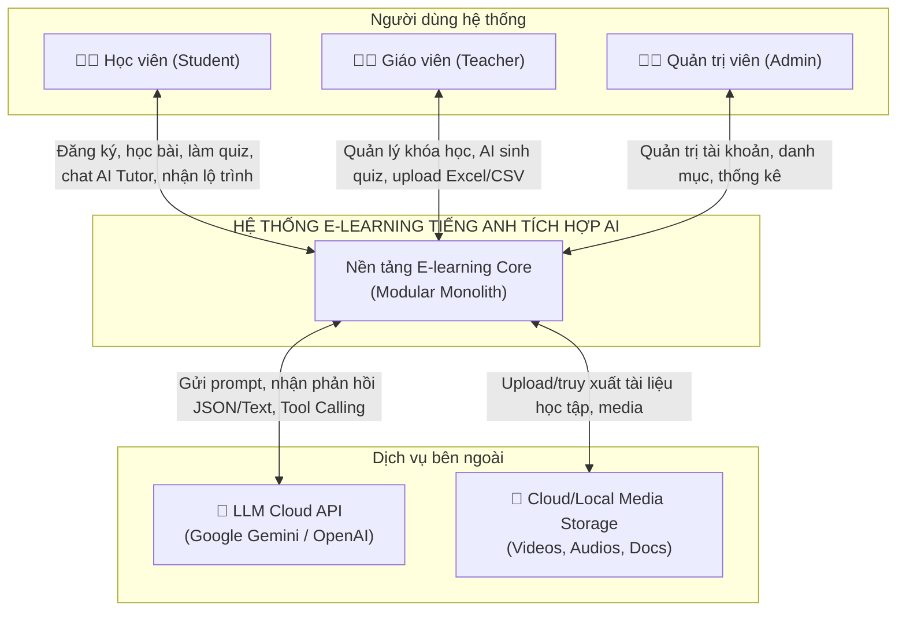
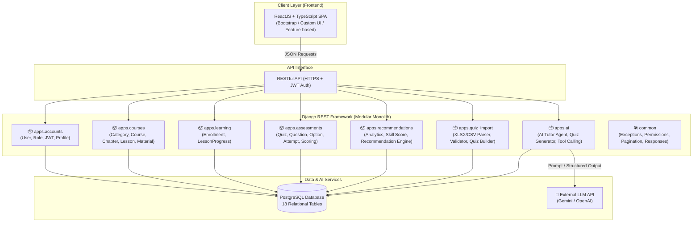
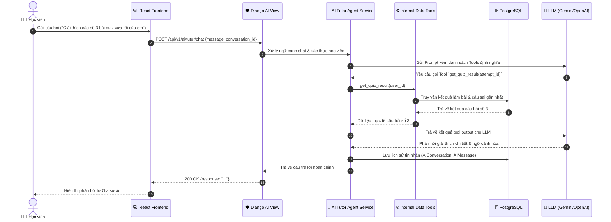
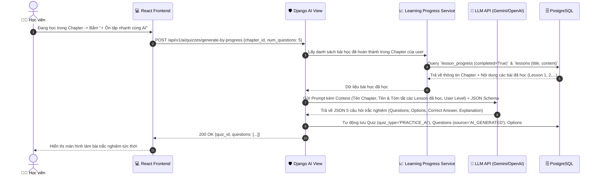
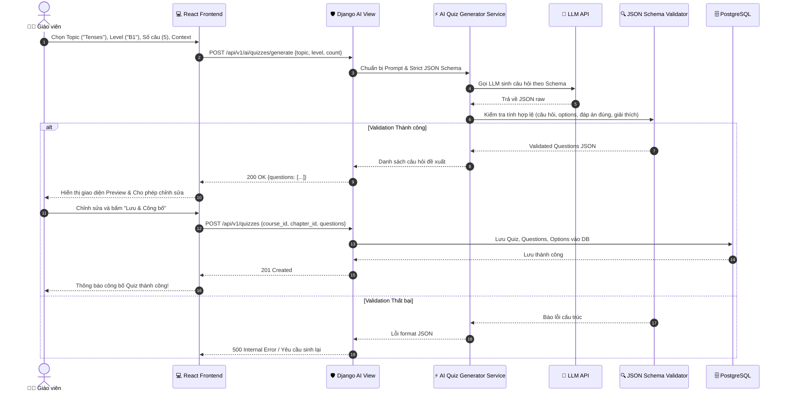
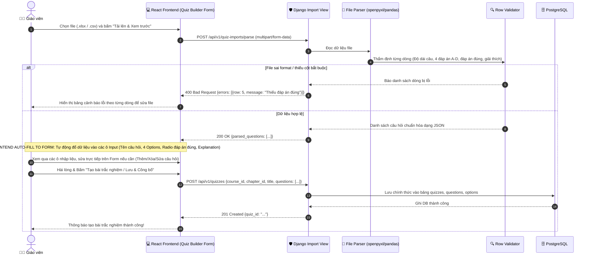
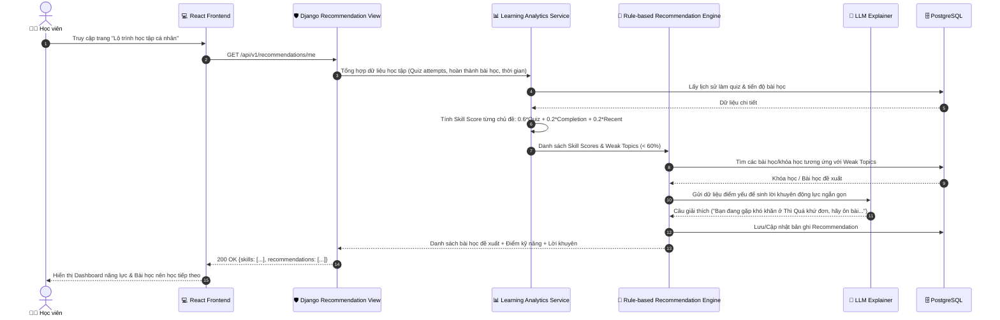

# TÀI LIỆU THIẾT KẾ KIẾN TRÚC HỆ THỐNG VÀ SƠ ĐỒ UML (SYSTEM DESIGN)

> **Đồ án tốt nghiệp:** Xây dựng nền tảng E-learning tiếng Anh tích hợp trí tuệ nhân tạo hỗ trợ học tập và cá nhân hóa lộ trình  
> **Sinh viên:** Lê Văn Thái (MSSV: 2251220232 - Lớp: 22CT5)  
> **Kiến trúc:** Modular Monolith

---

## 1. Sơ đồ ngữ cảnh (Context Diagram)

---

## 2. Sơ đồ kiến trúc tổng thể (System Architecture)

---

## 3. Sơ đồ Use Case tổng thể (Use Case Diagram)

```mermaid
flowchart LR
    subgraph StudentUseCases [Chức năng Học viên]
        UC_S1((Đăng ký / Đăng nhập))
        UC_S2((Xem & Đăng ký khóa học))
        UC_S3((Học bài & Ghi nhận tiến độ))
        UC_S4((Làm Quiz & Xem kết quả))
        UC_S5((Chat với AI English Tutor Agent))
        UC_S6((Xem Skill Score & Lộ trình đề xuất))
        UC_S7((Tạo Quiz ôn tập AI theo Chapter/Lesson đã học))
    end

    subgraph TeacherUseCases [Chức năng Giáo viên]
        UC_T1((CRUD Khóa học / Chương / Bài học))
        UC_T2((Upload video, tài liệu bài học))
        UC_T3((Tạo Quiz thủ công))
        UC_T4((Dùng AI sinh Quiz tự động theo Topic/Prompt))
        UC_T5((Upload File Excel/CSV -> Auto-fill Form -> Rà soát & Tạo Quiz))
        UC_T6((Xem thống kê học tập học viên))
    end

    subgraph AdminUseCases [Chức năng Admin]
        UC_A1((Quản lý User & Phân quyền))
        UC_A2((Quản lý Danh mục khóa học))
        UC_A3((Khóa / Mở tài khoản))
        UC_A4((Xem Dashboard thống kê toàn hệ thống))
    end

    Student --> UC_S1
    Student --> UC_S2
    Student --> UC_S3
    Student --> UC_S4
    Student --> UC_S5
    Student --> UC_S6
    Student --> UC_S7

    Teacher --> UC_T1
    Teacher --> UC_T2
    Teacher --> UC_T3
    Teacher --> UC_T4
    Teacher --> UC_T5
    Teacher --> UC_T6

    Admin --> UC_A1
    Admin --> UC_A2
    Admin --> UC_A3
    Admin --> UC_A4
```

---

## 4. Các sơ đồ tuần tự trọng tâm (Sequence Diagrams)

### 4.1. Luồng AI English Tutor Agent (kèm Tool Calling)

### 4.2. Phân hệ AI Quiz Generation

#### 4.2.1. Luồng Sinh Đề Ôn Tập AI theo Chapter & Tiến độ Bài học (Dành cho Học viên)

#### 4.2.2. Luồng AI Quiz Generator cho Giáo viên

### 4.3. Luồng Giáo viên Upload File -> Tự động điền Form Preview & Chỉnh sửa tương tác -> Lưu Quiz

### 4.4. Luồng Cá nhân hóa Lộ trình (Personalized Learning)

